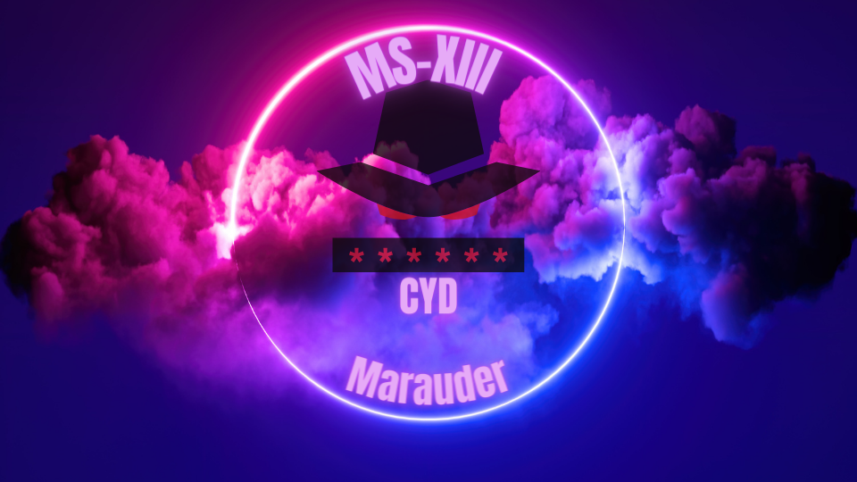

 

  <b>This repo will hold the flasher-tool to upload/flash a custom verion of <a href=hhttps://github.com/justcallmekoko/ESP32Marauder/wiki/about>Wifi Marauder</a> for the CYD AKA Cheap Yellow Display. This build features a few great fixes and customzations.</b> 
  
  
   
   

  ## 🌟 Upcoming Update Highlights 02/04/24 🌟

- **14.1 release: Fix for evil portal SD CARD**
- **Updated SplashScreen**
- **Renamed Some stuff**
- **Redone rickroll feature for a more custom one same principal just different texts etc**
- **More to come**
  
  ## 🌟 Update Highlights 24/03/24 🌟

- **Unrelated to the 0.13.9 release: SwiftPair Spam now 100% functional** (Thanks to <a href=https://github.com/Fr4nkFletcher>Fr4nkFletcher</a>)

  ## To install this fork of marauder
  <b>You can choose to use the Toxxics flasher tool to flash the latest version of Toxxics Marauder to your CYD (Micro usb only at the moment) or you can choose to build from a modified fork (CYD-ESP32Marauder) for a more hands on experince. Both options result in the same installation the second option gives you the ability to modify the files further if your comfy with that.</b>
